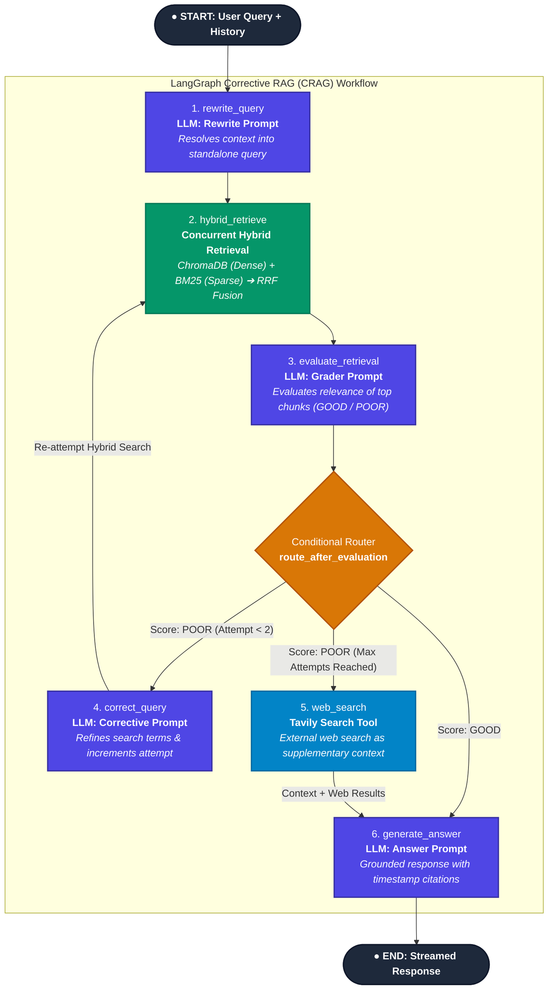

# YouTube RAG Intelligence

An AI-powered YouTube video assistant built with LangGraph, LangChain, openai/gpt-oss-120b, Google Gemini embeddings, LangChain native EnsembleRetriever, and ChromaDB. Chat with any video, generate summaries, and explore transcripts.

> Transcripts in any language are automatically answered in English.

## Live Demo

- **HuggingFace Space**: [YouTube RAG Intelligence on HuggingFace](https://huggingface.co/spaces/Aryan2301/YouTube_RAG_Intelligence)
- **AWS EC2 Deployment**: [http://32.236.58.120:80/](http://32.236.58.120:80/) *(Active Monday to Friday, 9:00 AM to 5:00 PM)*

---

## Features

- **Corrective RAG Chat** - Ask questions grounded strictly in transcript context with hybrid search (BM25 + Semantic), RRF fusion, and web fallback.
- **Smart Summary** - Map-reduce summarisation for any video length
- **Transcript Explorer** - Search keywords and jump to YouTube timestamps
- **Multi-language** - Transcripts in any language; responses always in English
- **Multi-chat** - Create, switch, and delete multiple chat sessions
- **Export** - Download chat history and summaries as `.txt` or `.md`

---

## Agent Architecture & Workflow

The assistant employs a **LangGraph-driven Corrective RAG (CRAG)** loop with hybrid retrieval (Dense Semantic + Sparse Lexical), LLM grading, adaptive query correction, and web search fallback:



---

## Tech Stack

| Layer | Technology |
|---|---|
| LLM | openai.gpt-oss-20b-1:0 (via AWS Bedrock) |
| Orchestration | LangGraph & LangChain |
| Embeddings | Google Gemini-embedding-2 |
| Vector Store | Hybrid ChromaDB + BM25 |
| Transcripts | Supadata API |
| UI | Streamlit |
| Runtime | Python 3.11 |

---

## Project Structure

```
requirements.txt              <- Python dependencies
Dockerfile                    <- Container build configuration
appspec.yml                   <- AWS CodeDeploy configuration
deploy/                       <- AWS CodeDeploy lifecycle scripts
backend/
    main.py                   <- FastAPI application & endpoints
    config.py                 <- API keys & environment detection
    requirements.txt          <- Backend dependencies
    core/
        chunking.py           <- Timestamp-aware document chunking
        embeddings.py         <- Gemini embeddings loader
        graph.py              <- LangGraph RAG workflow
        llm.py                <- AWS Bedrock GPT-OSS-20B loader (Groq/Ollama commented out)
        prompts/              <- RAG & summary system prompts
        retrieval.py          <- Hybrid ChromaDB + BM25 retrieval
        summary.py            <- Map-reduce summarisation engine
        vectorstore.py        <- Vector store initialization
    services/
        transcript_service.py <- Supadata transcript fetching
        web_search_service.py <- Tavily web search fallback
        youtube_service.py    <- Video metadata extraction
    utils/
        constants.py          <- Model configurations & constants
        timestamp.py          <- Timestamp formatting utilities
frontend/
    app.py                    <- Streamlit UI entrypoint
    requirements.txt          <- Frontend dependencies
    assets/
        styles.css            <- UI stylesheet
    components/
        chat.py               <- Streaming RAG chat interface
        landing.py            <- Hero & empty state landing page
        sidebar.py            <- Sidebar & video loading controls
        summary.py            <- Summary tab & download buttons
        transcript.py         <- Interactive transcript explorer
    services/
        api_client.py         <- Backend REST & SSE client
        chat_storage.py       <- Chat session persistence
    utils/
        constants.py          <- UI constants
        session.py            <- Streamlit session state management
        timestamp.py          <- Timestamp formatting utilities
        youtube.py            <- Video URL parsing utility
```

---

## Local Setup

### 1. Clone

```bash
git clone https://github.com/Aryanupadhyay23/Youtube-RAG-Intelligence.git
cd Youtube-RAG-Intelligence
```

### 2. Create Virtual Environment

```bash
python -m venv venv

# Linux / Mac
source venv/bin/activate

# Windows
venv\Scripts\activate
```

### 3. Install Dependencies

```bash
pip install -r requirements.txt
```

### 4. Create .env

Create a `.env` file in the root of the project:

# Ollama Configuration (Video Summaries & Chat with Fallback Keys):
OLLAMA_API_KEY_ONE=your_primary_ollama_api_key
OLLAMA_API_KEY_SECOND=your_second_ollama_api_key
OLLAMA_API_KEY_THIRD=your_third_ollama_api_key
OLLAMA_HOST=https://ollama.com
OLLAMA_SUMMARY_MODEL=gpt-oss:20b

SUPADATA_KEY_1=your_supadata_key_here
SUPADATA_KEY_2=your_second_supadata_key_here
SUPADATA_KEY_3=your_third_supadata_key_here
SUPADATA_KEY_4=your_fourth_supadata_key_here
GOOGLE_API_KEY=your_google_api_key_here
TAVILY_API_KEY=your_tavily_api_key_here

# Ephemeral In-Memory Vector Store & Inactivity TTL:
MAX_ACTIVE_VIDEOS=10
VIDEO_INACTIVITY_TTL_MINUTES=45
```

> Never commit `.env` to git. It is already listed in `.gitignore`.

### 5. Run the Application

The application consists of a FastAPI backend and a Streamlit frontend. You need to run **both** for the application to work correctly.

**Terminal 1 (Backend API):**
```bash
uvicorn backend.main:app --reload --port 8000
```

**Terminal 2 (Frontend UI):**
```bash
streamlit run frontend/app.py
```

Open http://localhost:8501 in your browser.

---

## HuggingFace Spaces Deployment

### Step 1 - Create a New Space

1. Go to https://huggingface.co/new-space
2. Fill in:
   - Space name: `youtube-rag-intelligence` (or your choice)
   - License: `MIT`
   - SDK: `Docker`  <-- important, NOT Streamlit SDK
   - Visibility: Public or Private

### Step 2 - Add Secrets

Do NOT put API keys in code or README. Use HuggingFace Secrets only.

Go to your Space -> Settings -> Variables and Secrets -> New Secret

Add each of the following:

| Secret Name | Required | Where to Get It |
|---|---|---|
| `AWS_ACCESS_KEY_ID` | Required | AWS IAM Console |
| `AWS_SECRET_ACCESS_KEY` | Required | AWS IAM Console |
| `AWS_REGION` | Optional (default: `us-east-1`) | AWS Bedrock Region |
| `SUPADATA_KEY_1` | Required | https://supadata.ai |
| `SUPADATA_KEY_2` | Optional | Fallback if key 1 hits rate limit |
| `SUPADATA_KEY_3` | Optional | Fallback if key 2 hits rate limit |
| `SUPADATA_KEY_4` | Optional | Fallback if key 3 hits rate limit |
| `GOOGLE_API_KEY` | Required | https://aistudio.google.com |
| `TAVILY_API_KEY` | Optional | https://tavily.com |

Secrets are injected into `os.environ` automatically before the app starts.
The app detects HuggingFace via the `SPACE_ID` env variable and skips `.env` loading entirely.

### Step 3 - Upload Project Files

Upload all files and folders EXCEPT:

```
.env
venv/
__pycache__/
*.pyc
*.pyo
.DS_Store
*.sqlite
*.sqlite3
*.sqlite-shm
*.sqlite-wal
```

Required files to upload:

```
requirements.txt
Dockerfile
README.md
backend/
frontend/
```

### Step 4 - Verify Deployment

Once the Space builds and starts:

1. Open the Space URL
2. Check the sidebar - it shows:
   - "Running on HuggingFace Spaces"
   - "GROQ_API_KEY loaded"
   - "SUPADATA_KEY (N keys loaded)"
3. If any key shows missing, go back to Settings -> Secrets and verify the name matches exactly

---

## Environment Variables Reference

| Variable | Local (.env) | HuggingFace (Secrets) | Required |
|---|---|---|---|
| `GROQ_API_KEY` | Yes | Yes | Required |
| `SUPADATA_KEY_1` | Yes | Yes | Required |
| `SUPADATA_KEY_2` | Yes | Yes | Optional |
| `SUPADATA_KEY_3` | Yes | Yes | Optional |
| `SUPADATA_KEY_4` | Yes | Yes | Optional |
| `GOOGLE_API_KEY` | Yes | Yes | Required |
| `TAVILY_API_KEY` | Yes | Yes | Optional |

---

## How Environment Detection Works

```
App starts
    |
    |-- SPACE_ID in os.environ?
    |       |
    |       |-- YES -> HuggingFace Spaces
    |       |         Secrets already in os.environ
    |       |         load_dotenv() is skipped
    |       |
    |       |-- NO  -> Local machine
    |                 load_dotenv() reads .env file
    |                 Keys loaded into os.environ
    |
    |-- os.environ.get("GROQ_API_KEY") works the same in both cases
```

---

## Common Errors

| Error | Cause | Fix |
|---|---|---|
| `GROQ_API_KEY is not set` | Secret not added or wrong name | Settings -> Secrets, check key is named exactly `GROQ_API_KEY` |
| `No Supadata API keys configured` | `SUPADATA_KEY_1` missing | Add it in Settings -> Secrets |
| `Space failed to build` | Dependency version conflict | Check `requirements.txt` versions are pinned exactly |
| `Empty transcript returned` | Video has no captions | Try a video with auto-generated or manual captions enabled |
| `Invalid YouTube URL` | Wrong URL format | Use `https://youtube.com/watch?v=VIDEO_ID` format |

---

## License

MIT License